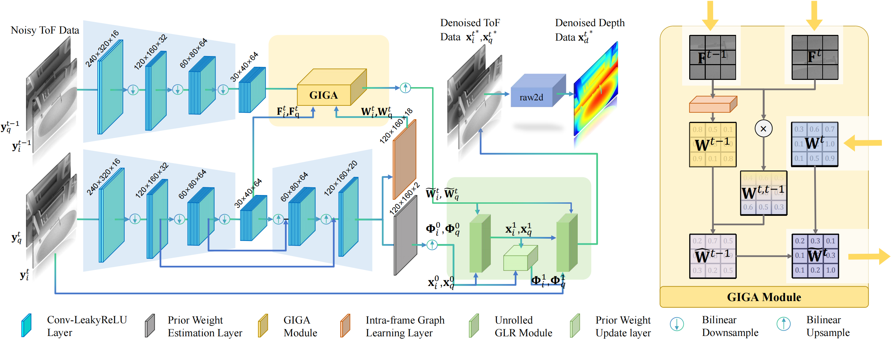
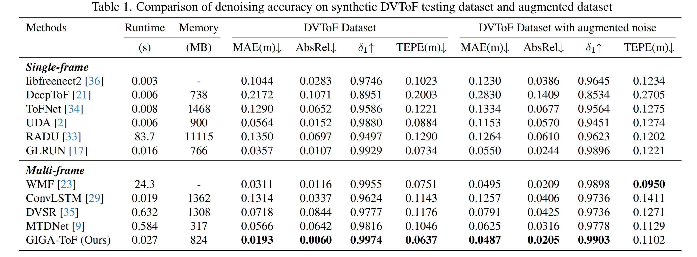
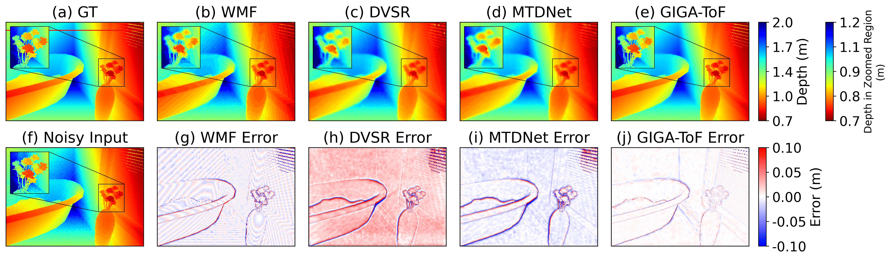
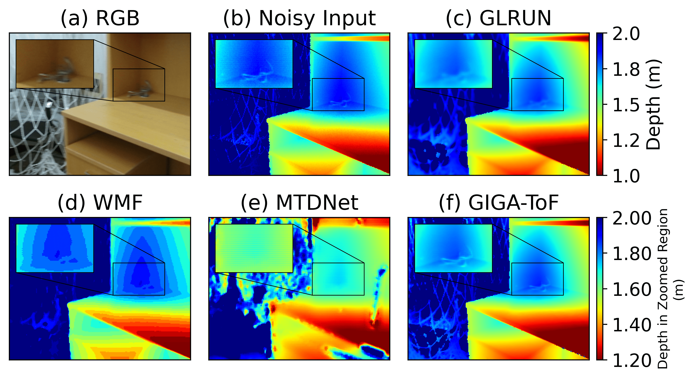
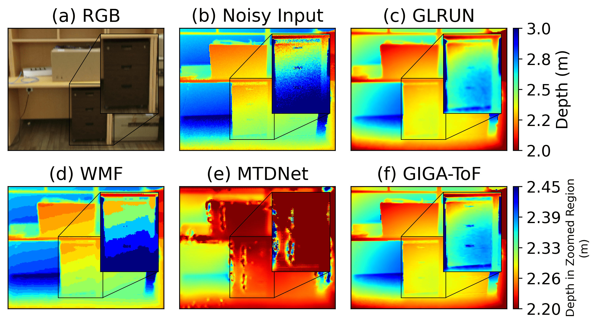

# [ICCV 2025] Consistent Time-of-Flight Depth Denoising via Graph-Informed Geometric Attention

> **Consistent Time-of-Flight Depth Denoising via Graph-Informed Geometric Attention**  
> Accepted by **ICCV 2025**
>*Weida Wang, Changyong He, Jin Zeng, Di Qiu*

<div align="center">
  
</div>


### 😆 Highlights

* 🚀 **Cross-frame graph fusion for ToF denoising**: Fuses motion-invariant graph structures across frames to achieve both temporal consistency and spatial sharpness.

* 🧠 **Graph-informed geometric attention (GIGA)**: Learns graph edges via attention from geometric features, enabling accurate cross-frame correspondence.

* 🔬 **Interpretable and robust design**: Unrolls MAP optimization with graph Laplacian regularization into a network, achieving high denoising accuracy and generalization to real ToF data.

* 📈 **State-of-the-art performance**: Outperforms prior works by at least 37.9% MAE and 13.2% TEPE on DVToF; robust on real Kinect v2 data without fine-tuning.


<p><strong>Comparison of denoising accuracy on DVToF dataset (normal / augmented noise)</strong></p>


<div align="center">
  
</div>


<div align="center">
  
</div>

<div align="center">
  
  
</div>

## Environment Setup
### Clone this directory
```
git clone https://github.com/davidweidawang/GIGA-ToF.git
```
### Install Dependencies
Ensure your environment has Python 3.9 or later installed. Use the following command to install required dependencies:
```
pip install -r requirements.txt
```

## Dataset Preparation
Download [DVToF dataset](https://pan.baidu.com/s/1eR0HZ5VeiNAsaH-_B3xOJA) and put it under `./dataset`. Extraction code: anwf


## Basic Usage
### Training
Run the following command to start model training:
```
python -u train.py \
    -b 32 \
    --dev 2 \
    -lr 2.5e-3 \
    --weight_decay 1e-5 \
    -out "/Path/to/models" \
    -d "/Path/to/results/debug" \
    -in '/Path/to/dataset' \
    -e 400 | tee giga_norm_T_weight.txt
```
Or you can run the script:
```
bash train.sh
```

### Inferencing
Run the following command to denoise noisy iq:
```
python predict.py \
    -in "/Path/to/noise/IQ/dir" \
    -ls "/Path/to/test/list" \
    -out "/Path/to/predicted/IQ/dir" \
    -out_mu "/Path/to/predicted/mu/dir" \
    -m "/Path/to/trained/GIGAToF/model" \
```
```
python IQ2corr.py \
   --list_path "/Path/to/test/list"
```
Or you can run the script:
```
bash predict.sh
```

Run Corr2Depth script after completing the above steps"
```
cd matlab_scripts
matlab
>> CorrToDepth      # Takes a long time
```

Convert depth from .mat format to .npy. You can also save depth to a .png image by set `visualize` to `True`. 
```
python mat2depth.py \
    --list_path "/Path/to/test/list" \
    --visualize False
```

### Evaluation
Evaluate trained model using the command:
```
python eval.py \
   -in "/Path/to/predicted/depth" \
   -gt "/Path/to/ideal/depth" \
   -flow "/Path/to/optic/flow" \
   -out "/Path/to/result/dir" \
   -list_path "/Path/to/test/list" \
   -v "Version"
```
Or you can run the script:
```
bash eval.sh
```

### Remove noise of a single image using a trained GIGA
```
python predict_single.py \
    -in "demo/raw" \
    -out_iq "./denoised_iq" \
    -m "models/checkpoint_best.pth"
```
Or you can run the script:
```
bash predict_single.sh
```

# References
If you find this repository useful for your research, please cite the following work.
```
@article{wang2025consistent,
  title={Consistent Time-of-Flight Depth Denoising via Graph-Informed Geometric Attention},
  author={Wang, Weida and He, Changyong and Zeng, Jin and Qiu, Di},
  journal={arXiv preprint arXiv:2506.23542},
  year={2025}
}
```