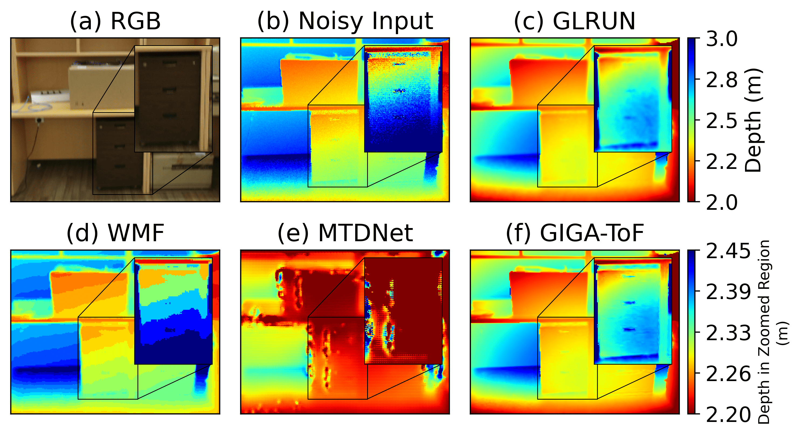

# [ICCV 2025] Consistent Time-of-Flight Depth Denoising via Graph-Informed Geometric Attention

> **Consistent Time-of-Flight Depth Denoising via Graph-Informed Geometric Attention**  
> Accepted by **ICCV 2025**
>*Weida Wang, Changyong He, Jin Zeng, Di Qiu*

  

### 😆 Highlights

* 🚀 **Cross-frame graph fusion for ToF denoising**: Fuses motion-invariant graph structures across frames to achieve both temporal consistency and spatial sharpness.

* 🧠 **Graph-informed geometric attention (GIGA)**: Learns graph edges via attention from geometric features, enabling accurate cross-frame correspondence.

* 🔬 **Interpretable and robust design**: Unrolls MAP optimization with graph Laplacian regularization into a network, achieving high denoising accuracy and generalization to real ToF data.

* 📈 **State-of-the-art performance**: Outperforms prior works by at least 37.9% MAE and 13.2% TEPE on DVToF; robust on real Kinect v2 data without fine-tuning.

<strong>Comparison of denoising accuracy on DVToF dataset (normal / augmented noise)</strong>

  

  

  
  

